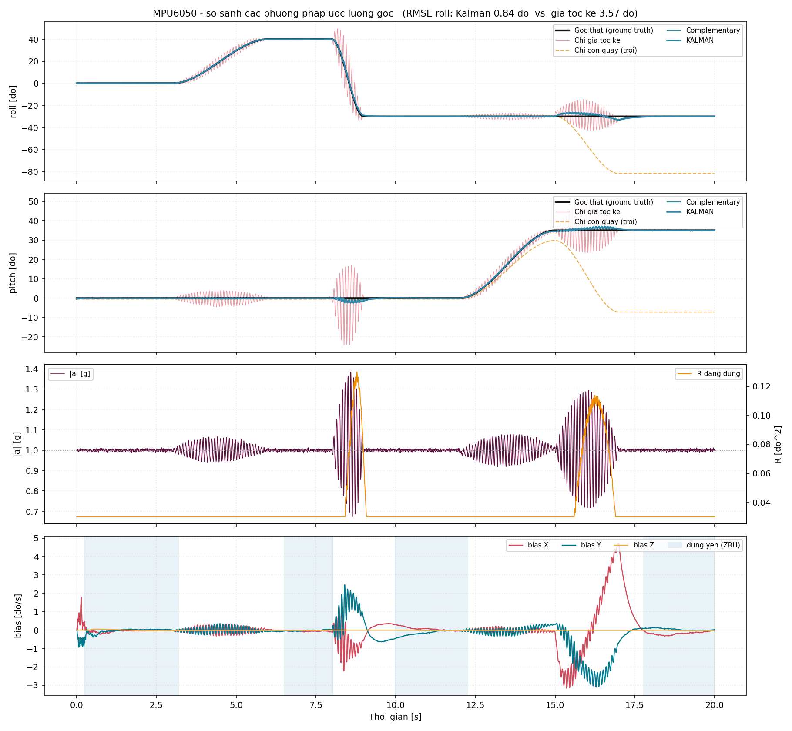
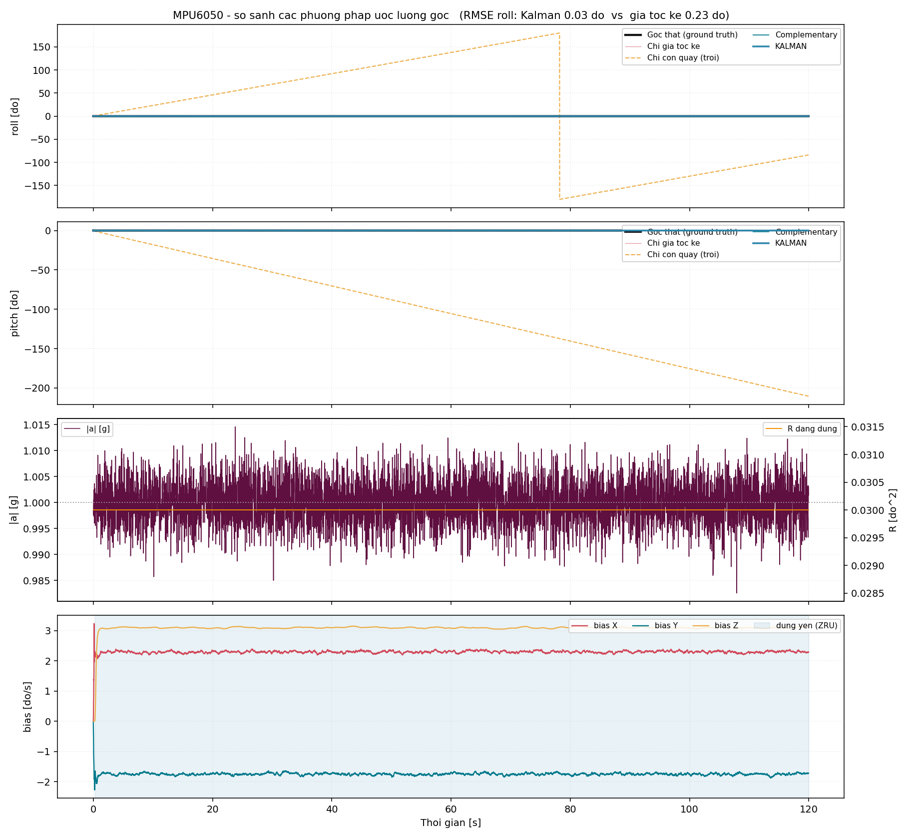

# Bộ lọc Kalman ứng dụng cho cảm biến MPU6050 trên ESP32

Ước lượng góc quay real-time từ MPU6050 (accelerometer + gyroscope) qua I2C trên ESP32 DevKit V1.
Hợp nhất hai nguồn cảm biến bằng bộ lọc Kalman 2 trạng thái, có hiệu chỉnh offset và bốn lớp xử lý
nhiễu rung do thao tác quay thủ công.

**ESP-IDF v6.0 · C thuần · không dùng component ngoài ·**

---

## 1. Kết quả

Quỹ đạo mô phỏng "quay thanh cầm tay" 20 s (nghiêng chậm → lật nhanh 105 °/s → quét pitch →
quay yaw 90°), có rung tay 0.35 g @ 11 Hz và gia tốc hướng tâm/tiếp tuyến của cánh tay bán kính 30 cm:

| Phương pháp | RMSE roll | RMSE pitch | Nhận xét |
|---|---:|---:|---|
| Chỉ gia tốc kế | 3.663° | 3.558° | Nhiễu răng cưa, biên độ tới ±25° khi lắc |
| Chỉ con quay | 22.953° | 18.940° | Trôi không giới hạn |
| Complementary (α=0.98) | 0.699° | 0.405° | Tốt, nhưng không tự bù bias |
| **Kalman 2 trạng thái** | **0.861°** | **0.510°** | Tự ước lượng bias, R có nghĩa vật lý |

Kalman **tốt hơn gia tốc kế 4.3×** và **tốt hơn con quay 27×**.

**Tính toán ổn định**:

| Phép đo | Kết quả |
|---|---:|
| Roll drift, đứng yên 5 phút | **0.006°** |
| Pitch drift, đứng yên 5 phút | **0.025°** |
| Yaw drift, chuyển động thực tế (81.4% thời gian nghỉ) | **0.822°** (0.164 °/phút) |
| Yaw drift, tích phân trần cùng điều kiện | 2.806° (0.561 °/phút) |
| RMSE yaw trên toàn 300 s | 0.599° |
| Sai số yaw lớn nhất | 1.119° |




*Hàng 1–2: roll và pitch. Đen = góc thật, hồng = chỉ gia tốc kế, cam gạch = chỉ con quay (trôi
khỏi khung hình), xanh đậm = Kalman. Hàng 3: `|a|` và R thích nghi phản ứng. Hàng 4: các đoạn
đứng yên được phát hiện (ZRU hoạt động).*

---


## 2. Phần cứng và nối dây

```
   ESP32 DevKit V1              MPU6050 (GY-521)
   ┌──────────────┐             ┌─────────────┐
   │  3V3 ────────┼─────────────┼─── VCC      │   ⚠ 3V3, KHÔNG dùng 5V
   │  GND ────────┼─────────────┼─── GND      │
   │  GPIO21 ─────┼─────────────┼─── SDA      │
   │  GPIO22 ─────┼─────────────┼─── SCL      │
   │              │        ┌────┼─── AD0      │   AD0→GND ⇒ địa chỉ 0x68
   │  GND ────────┼────────┘    │             │
   └──────────────┘             └─────────────┘
                     I2C 400 kHz
```

Module GY-521 đã có pull-up 4.7 kΩ onboard; firmware vẫn bật pull-up nội để hoạt động được cả với
MPU6050 trần.

### Cấu hình cảm biến

| Thanh ghi | Giá trị | Lý do |
|---|---|---|
| `PWR_MGMT_1` = `0x01` | CLKSEL = PLL trục X gyro | Chính xác hơn dao động nội 8 MHz (lệch ±1%); sai số tần số lấy mẫu sẽ thành sai số tỉ lệ trong tích phân góc |
| `CONFIG` = `0x03` | DLPF 44 Hz accel / 42 Hz gyro | Lớp chống rung **thứ nhất** — cắt nhiễu ngay trên chip. Trễ 4.9 ms, đủ nhỏ ở 200 Hz |
| `SMPLRT_DIV` = `4` | 1000/(1+4) = **200 Hz** | Ghi **sau** `CONFIG` vì ý nghĩa của nó phụ thuộc `DLPF_CFG` |
| `GYRO_CONFIG` = `0x08` | **±500 °/s**, 65.5 LSB/(°/s) | Lật thanh bằng tay dễ vượt 250 °/s; một khi con quay saturate thì mất hoàn toàn thông tin đoạn đó — lỗi không phục hồi được |
| `ACCEL_CONFIG` = `0x00` | ±2 g, 16384 LSB/g | Độ phân giải góc tốt nhất |
| Đọc `0x3B`, 14 byte | Burst một giao dịch | Accel và gyro **cùng một thời điểm lấy mẫu**. Đọc rời hai lần sẽ làm hai nguồn lệch pha mà bộ lọc không hề biết |

---

## 3. Mô hình toán học

### 3.1 Bộ lọc Kalman 2 trạng thái

Một instance cho roll, một cho pitch, một cho yaw.

**Trạng thái** `x = [θ, b]ᵀ` — θ là góc (deg), b là bias con quay (deg/s).

**Con quay là ĐẦU VÀO ĐIỀU KHIỂN.** Measurement duy nhất là góc từ gia tốc kế.

Dự đoán:

```
θ⁻ = θ + (ω − b)·dt          F = ⎡1  −dt⎤        Q = ⎡Q_angle·dt      0     ⎤
b⁻ = b                           ⎣0   1 ⎦            ⎣    0      Q_bias·dt ⎦

P⁻ = F·P·Fᵀ + Q
```

Khai triển tường (`kalman.c:74`) — tránh nhân ma trận tổng quát, và phải đọc P vào biến local
trước vì `P00` mới phụ thuộc cả `P01, P10, P11` cũ:

```
P00 ← P00 + dt·(dt·P11 − P01 − P10) + Q_angle·dt
P01 ← P01 − dt·P11
P10 ← P10 − dt·P11
P11 ← P11 + Q_bias·dt
```

Với `z` = góc gia tốc kế, `H = [1  0]`. Vì H là vector hàng nên **S là vô hướng** —
không cần nghịch đảo ma trận, lý do filter hoạt động ở 200 Hz trên ESP32:

```
y  = wrap180(z − θ⁻)              ← wrap BẮT BUỘC cho roll/yaw (dải ±180)
S  = P00 + R
K0 = P00/S ,  K1 = P10/S
θ  = θ⁻ + K0·y ,  b = b⁻ + K1·y
P  ← (I − K·H)·P
```

Sau mỗi step: cưỡng chế `P01 = P10` và `P00, P11 ≥ 0`. Sai số làm tròn tích luỹ sẽ làm P lệch đối
xứng, lâu dần sinh độ lợi vô nghĩa khi chạy nhiều giờ.

Tham số: `Q_angle = 0.001`, `Q_bias = 0.003`, `R_measure = 0.03`.

### 3.2 Góc từ gia tốc kế

```
roll  = atan2(ay, az)                      → dải ±180°
pitch = atan2(−ax, √(ay² + az²))           → dải ±90°
```

Không phụ thuộc yaw — **đây chính là lý do toán học khiến yaw không khả quan sát** bằng IMU 6 trục.

---

## 4. Cơ chế xử lý nhiễu rung

### 4.1 DLPF phần cứng
Cắt nhiễu tần cao ngay trên chip, trước khi dữ liệu ra khỏi cảm biến (mục 3).

### 4.2 Biến đổi Euler đầy đủ — cơ chế quan trọng nhất

```
φ̇ = p + (q·sinφ + r·cosφ)·tanθ
θ̇ = q·cosφ − r·sinφ
ψ̇ = (q·sinφ + r·cosφ)/cosθ
```

Hầu hết implementation dùng xấp xỉ `p → roll_rate`, `q → pitch_rate`. Xấp xỉ đó **sai nghiêm trọng**
khi thanh đang nghiêng: nghiêng pitch 35° rồi quay yaw 67 °/s thì con quay trục X đọc ra
`p = −67·sin(35°) = −38.7 °/s` **mặc dù roll hoàn toàn không đổi**. Xấp xỉ sẽ tích phân con số giả
đó thành sai số roll.

Con số này đo được, không phải ước đoán — `ahrs_cfg_t.full_euler = false` bật lại xấp xỉ đơn giản
để so sánh trực tiếp (TEST 9):

| | RMSE roll | RMSE pitch |
|---|---:|---:|
| Xấp xỉ `p → roll_rate` | 1.885° | 1.273° |
| **Biến đổi Euler đầy đủ** | **0.861°** | **0.510°** |
| Tốt hơn | **2.19×** | **2.50×** |

Đây là nguồn sai số chi phối, lớn hơn hẳn sai số do rung. Bản thân con số `−38.43 °/s` được kiểm
chứng chính xác trong `test_convention.c` phần F.

`cosθ` bị chặn ở 0.1 (pitch ~±84.3°) để không phân kỳ khi tiến tới gimbal lock.

### 4.3 R thích nghi

Gia tốc kế chỉ đo đúng góc khi lực duy nhất tác dụng lên nó là trọng lực. Độ lệch của `‖a‖` khỏi
1 g cho biết **phép đo đang xấu đến mức nào**, từ đó nói cho Kalman biết nên giảm tin bao nhiêu:

```
e_lp ← e_lp + (dt/τ)·(|‖a‖−1| − e_lp)      τ = 0.30 s

e_lp ≤ 0.10 g  →  R = R_measure
e_lp > 0.10 g  →  R = R_measure·(1 + 40·(e_lp − 0.10)),  chặn ở 100×
|‖a‖−1| > 0.50 g (tức thời)  →  BỎ HẲN measurement, chỉ dự đoán
```

**Điểm then chốt là bộ lọc thông thấp.** Lý do đo lường được, không phải trực giác:

- Rung dao động (trung bình bằng 0) làm `|‖a‖−1|` tức thời tăng mạnh, nhưng bản thân Kalman đã
  triệt tiêu được nó qua đặc tính thông thấp. Giảm tin lúc đó **chỉ thêm trễ**.
- Gia tốc tuyến tính **duy trì** (hướng tâm khi vung thanh) mới làm **lệch hệ thống** góc gia tốc kế.

`|‖a‖−1|` tức thời không phân biệt được hai trường hợp; lọc thông thấp thì phân biệt được. Ở τ=0.3 s,
rung 11 Hz bị suy giảm ~20 lần còn gia tốc hướng tâm đi qua gần nguyên vẹn.

| | RMSE roll | RMSE pitch |
|---|---:|---:|
| R cố định | 0.883° | 0.541° |
| **R thích nghi (đã lọc thông thấp)** | **0.861°** | **0.510°** |
| Cải thiện | +2.4% | +5.8% |

Với quỹ đạo này thành phần nhiễu duy trì
(gia tốc hướng tâm ở bán kính 30 cm, đỉnh ~0.1 g) chỉ vừa chớm ngưỡng 0.10 g. Cơ chế sẽ có giá trị
lớn hơn nhiều khi thanh dài hơn, quay nhanh hơn, hoặc khi có gia tốc tuyến tính thực sự.

### 4.4 ZRU cho yaw

Không có từ kế nên không có nguồn đo yaw tuyệt đối. Nhưng khi thiết bị **đứng yên** nhận được yaw thật không thay đổi. Phép đo này hợp lệ:

```
đang đứng yên   →  kalman_update_R(&k_yaw, yaw_anchor, ψ̇, dt, R_zru)
đang chuyển động →  kalman_predict(&k_yaw, ψ̇, dt)
```

Nhờ vậy bias trục Z trở nên khả quan sát và được ước lượng.

**Phát hiện đứng yên dùng ĐỘ LỆCH ĐỘNG, không dùng giá trị tuyệt đối:**

```
ema[i] ← ema[i] + λ·(ω[i] − ema[i])
dev[i] ← dev[i] + λ·(|ω[i] − ema[i]| − dev[i])        λ = dt/0.15s

tĩnh ⟺ mọi dev[i] < 1.5 °/s
     ∧ mọi |ω[i] − b̂[i]| < 20 °/s        (chốt thô, chặn quay đều nhanh)
     ∧ |‖a‖ − 1| < 0.05 g
```

Bias con quay là **hằng số** nên nó không làm tăng độ lệch. Nếu so bằng giá trị tuyệt đối, một chip
chưa hiệu chỉnh có bias 3 °/s sẽ mãi mãi bị coi là "đang chuyển động" → ZRU không bao giờ chạy →
bias trục Z không bao giờ học được. **Vòng lặp chết.** Sửa chỗ này làm bias Z hội tụ về 3.144 °/s
(giá trị tiêm vào: 3.100).

---

## 5. Hiệu chỉnh offset

1000 mẫu (5 s @ 200 Hz) khi đứng yên. Kết quả lưu NVS, giữ qua các lần khởi động — **giữ nút BOOT
lúc khởi động để hiệu chỉnh lại**.

| | Tiêm vào | Đo được | Sai số |
|---|---:|---:|---:|
| Bias X | +2.300 | +2.309 | 0.009 °/s |
| Bias Y | −1.750 | −1.744 | 0.006 °/s |
| Bias Z | +3.100 | +3.109 | 0.009 °/s |

Sai số chuẩn lý thuyết của trung bình 1000 mẫu nhiễu 0.4 °/s RMS là 0.013 °/s — kết quả đúng như
dự đoán thống kê.

Các bước kiểm tra:

| Kiểm tra | Điều kiện | Xử lý |
|---|---|---|
| Chưa đủ mẫu | `n < n_target` | Báo lỗi |
| Đang chuyển động | `std(gyro) > 2 °/s` hoặc `|‖a‖−1| > 0.1 g` | Thử lại, tối đa 3 lần |
| Không nằm phẳng | `mean(az) < 0.90 g` | **Vẫn trả về bias con quay** (không phụ thuộc hướng đặt), chỉ bỏ offset gia tốc kế |

-> offset gia tốc kế chỉ tách được khỏi trọng lực nếu biết trước hướng của
trọng lực. Không nằm phẳng thì không thể phân biệt offset với thành phần trọng lực.

---

## 6. Kiểm chứng

Thuật toán được kiểm chứng bằng simulator có ground truth:
`host_test/`
Simulator theo chiều vật lý: quỹ đạo Euler thật → đạo hàm số → kinh học nghịch 3-2-1
→ chiếu trọng lực vào hệ thân → cộng bias, nhiễu Gauss, rung dao động, và gia tốc hướng tâm/tiếp
tuyến `ω×(ω×r) + α×r`. PRNG xorshift32 seed cố định ⇒ **kết quả tái lập được**.

```bash
cd host_test && make run        # test_convention 203/203, test_kalman 31/31, ~5 giây
```

| Test | Nội dung | Kết quả |
|---|---|---|
| 1 | Hiệu chỉnh lấy lại đúng bias đã tiêm | Sai số < 0.009 °/s |
| 2 | Ba lớp kiểm tra hợp lệ bắt đúng lỗi | 3/3 phát hiện đúng |
| 3 | RMSE 4 phương pháp trên quỹ đạo quay tay | Kalman thắng accel 4.3×, gyro 27× |
| 4 | R thích nghi có thật sự giúp | +2.4% roll, +5.8% pitch |
| 5 | Kalman tự ước lượng bias (không hiệu chỉnh trước) | Sai số 0.014 / 0.027 / 0.044 °/s |
| 6 | Drift 300 s khi đứng yên hoàn toàn | Roll 0.006°, pitch 0.025° |
| 7 | Kalman so với complementary, hai tình huống | Xem §8.1 |
| 8 | Drift yaw với chuyển động xen kẽ quay/nghỉ | 0.822° sau 5 phút |
| 9 | Giá của xấp xỉ `p → roll_rate` | Euler đầy đủ tốt hơn 2.19× / 2.50× |
| 10 | Bias không gian Euler có làm giảm độ chính xác? | **Không** — RMSE 0.0289° vs 0.0286° |

### 6.1 Neo quy ước quay vào vật lý — bịt một điểm mù thật

`imu_sim.c:body_rates_d()` và `ahrs.c:body_to_euler_rates()` là **nghịch đảo chính xác** của nhau.
Hệ quả: nếu **cả hai** cùng sai dấu, sai số tự triệt tiêu qua vòng sim → filter, và **không phép đo
RMSE nào bắt được**. Trên phần cứng thật thì không có ai triệt tiêu hộ, và góc sẽ sai dấu.

Đó là điểm mù thật, không phải giả định. `test_convention.c` bịt nó bằng một **đường thứ ba độc lập**:
ma trận quay dựng từ các phép quay sơ cấp, rồi lấy tốc độ góc từ `[ω]ₓ = −Ṙ·Rᵀ`. Ba đường phải gặp
nhau (203 tiêu chí, ở 6 bộ góc × 5 bộ tốc độ):

| Mục | Kiểm tra |
|---|---|
| A | `R·[0,0,1]` khớp đúng công thức gia tốc của sim (sai số < 1e-12) |
| B | **Sự thật vật lý:** quay yaw thuần không đổi số đọc gia tốc kế — lý do toán học của việc yaw không khả quan sát |
| C | Công thức tốc độ góc của sim khớp `−Ṙ·Rᵀ` (sai số < 1e-6 rad/s) |
| D | `body_to_euler_rates` khử đúng về `φ̇, θ̇, ψ̇` (sai số < 1e-9) |
| E | `ahrs_accel_angles` là nghịch đảo của công thức gia tốc (sai số < 1e-4°) |
| F | **Sự thật vật lý:** pitch 35° + yaw 67 °/s ⇒ trục X đọc `−38.43 °/s` giả, và Euler đầy đủ khử đúng về 0 |

### Kalman tự học bias con quay



Chạy **không hiệu chỉnh trước**. Panel dưới: cả ba bias hội tụ về đúng 2.30 / −1.75 / +3.10 °/s
trong khoảng 1 giây. Panel trên: con quay trần trôi 180° và wrap, còn Kalman nằm khớp lên góc thật.
Đây là trạng thái thứ hai của bộ lọc làm việc — complementary không có cơ chế nào làm được điều này.

---

## 7. Nhận định

### 7.1 Complementary ngang hoặc hơn Kalman khi đã hiệu chỉnh sạch

| | Complementary | Kalman |
|---|---:|---:|
| Đã hiệu chỉnh offset (roll) | **0.699°** | 0.861° |
| Đã hiệu chỉnh offset (pitch) | **0.405°** | 0.510° |
| **Chưa** hiệu chỉnh offset (roll) | 1.155° | **0.883°** |
| **Chưa** hiệu chỉnh offset (pitch) | 0.630° | **0.469°** |

Kết luận trung thực: khi bias đã bị trừ sạch, trạng thái thứ hai của Kalman **không còn việc gì để
làm**, và complementary với α tinh chỉnh tốt thì ngang bằng. Giá trị thực của mô hình 2 trạng thái
thể hiện khi **còn** bias — nó tự dò và bù (hơn 24% ở roll, 26% ở pitch), còn complementary thì không.

-> nếu chỉ cần roll/pitch và chấp nhận hiệu chỉnh thủ công mỗi lần bật máy,
complementary 3 dòng code là đủ. Kalman xứng đáng khi cần **tự động bù bias trôi theo nhiệt độ**,
cần **R có nghĩa vật lý** để gắn R thích nghi vào, và cần **hiệp phương sai** để biết bộ lọc đang
tự tin đến đâu.

### 7.2 Sai số chi phối là coupling Euler, không phải rung

Dự tính R thích nghi sẽ support luôn. Nó **làm kém đi** (RMSE 1.93 vs 1.59). Truy ra thì
nguyên nhân nằm ở chỗ khác: xấp xỉ `p → roll_rate` biến chuyển động yaw thành sai số roll
giả, và sai số đó lớn hơn sai số do rung. Lúc đó gia tốc kế là thứ **duy nhất** giữ roll đúng —
mà R thích nghi lại đi giảm tin nó. Sửa nhánh con quay là điều kiện để R thích
nghi phát huy.

### 7.3 R thích nghi phải dựa trên thành phần đã lọc

Dùng `|‖a‖−1|` tức thời thì R thích nghi vẫn kém hơn R cố định.

### 7.4 Drift yaw phụ thuộc mạnh vào tỷ lệ thời gian nghỉ

0.822°/5 phút đạt được với **81.4% thời gian ở trạng thái đứng yên**. Nếu thiết bị quay liên
tục không nghỉ, ZRU không có cơ hội chạy và yaw sẽ trôi theo tốc độ của bias dư — về nguyên tắc
không chặn được. Con số này **không** nên đọc như một đảm bảo tuyệt đối.


| # | Vị trí | Lỗi | Ảnh hưởng |
|---|---|---|---|
| 1 | `imu_sim.c` gia tốc tuyến tính | **Sai dấu.** Gia tốc kế đo specific force `f = (a − g)/\|g\|`, nên `a` vào với dấu **cộng**, tôi viết trừ | Nghiêm trọng nhất — làm **mọi số liệu** trong bản trước không tin được. Đã sửa và đo lại toàn bộ |
| 2 | `main.c` vòng 200 Hz | `t_prev_us` nhảy **trước** khi biết đọc I2C có thành công. Mỗi mẫu rớt xoá đúng một chu kỳ khỏi trục thời gian | 0.5° bị mất cho mỗi mẫu rớt ở 100 °/s, và sai số tích luỹ **một chiều** |
| 3 | `ahrs.c` chặn `CT_MIN` | Chặn kiểu "giữ nguyên dấu": pitch vượt 90° làm `cos θ` nhảy `+0.1 → −0.1`, **đảo dấu** cả `tanθ` lẫn `1/cosθ` | Số hạng coupling roll đảo chiều → hồi tiếp dương → có thể mất ổn định khi lật nhanh |
| 4 | `ahrs.h` khối "GIOI HAN DA BIET" | Comment còn nói dùng xấp xỉ `p → roll_rate`, trong khi code đã làm Euler đầy đủ | Tài liệu nói sai về chính nó — người sửa sau sẽ tin theo |

Lỗi #1 đáng nói thêm: nó nằm trong **simulator**, không phải firmware. Một lỗi ở dụng cụ đo thì
không làm firmware chạy sai, nhưng làm mọi kết luận rút ra từ nó mất giá trị. Sau khi sửa, RMSE
Kalman đổi từ 0.764° thành 0.861° (roll) và 0.584° thành 0.510° (pitch) — kết luận định tính giữ
nguyên, nhưng con số thì khác, và bảng trong bản trước đã sai.

Lỗi #3 là loại chỉ lộ ra khi đọc kỹ biên: `pitch_acc` bị `atan2` chặn cứng ở ±90°, nên **phép đo**
không bao giờ vượt — nhưng **bước dự đoán** tích phân tự do và vượt được, nhất là khi measurement
bị bỏ vì rung. Đã sửa thành chặn dương một bên, cộng thêm chặn chính trạng thái pitch vào `[−90, 90]`
là miền định nghĩa của biểu diễn.

| Flow code | Ngưỡng kích hoạt | Giá trị lớn nhất đạt được | Có chạy? |
|---|---|---|---|
| Chặn `CT_MIN` | \|pitch\| > 84.3° | 37.07° | ❌ |
| Chặn pitch ±90° | \|pitch\| > 90° | 37.07° | ❌ |
| Toàn bộ nhánh `wrap180` | \|roll\| > 180° | 40.04° | ❌ |
| Bỏ measurement khi rung | \|‖a‖−1\| > 0.50 g | 0.385 g | ❌ |

Thêm quỹ đạo `IMU_SIM_EXTREME` (pitch ±88°, roll quay trọn 360° qua ±180°, hai cú sốc gia tốc
1.4 g) và TEST 11 đếm trực tiếp số mẫu đi vào từng nhánh:

| Flow code | Số mẫu chạy qua | Đạt tới |
|---|---:|---:|
| Vùng chặn `CT_MIN` | 1508 | 88.79° |
| Nhánh wrap roll | 520 | 179.99° |
| Bỏ measurement | 44 | 1.363 g |

Không có NaN nào lọt ra, và bộ lọc không phân kỳ ở góc biên (RMSE roll 2.745°, pitch 0.605° —
cao hơn mức 0.861°/0.510° bình thường, đúng như kỳ vọng khi tiến gần gimbal lock).

---

## 8. Giới hạn đã biết

| Giới hạn | Bản chất | Hướng khắc phục |
|---|---|---|
| **Yaw trôi** | MPU6050 không có từ kế ⇒ yaw không khả quan sát. Ràng buộc **vật lý**, không phải lỗi code | MPU9250 / BNO055 (có từ kế) |
| **Suy biến khi pitch → ±90°** | Gimbal lock của biểu diễn Euler; `cosθ` bị chặn ở 0.1 | EKF quaternion |
| **Quay đều chậm bị nhận nhầm là tĩnh** | Quay hoàn toàn đều, chậm hơn 20 °/s, quanh đúng trục trọng lực, kéo dài > 0.25 s. Chuyển động tay thật luôn có rung nên bộ đo độ lệch bắt được; chỉ xảy ra với bàn quay có động cơ | Thêm ngưỡng tích luỹ góc |
| **Chưa chạy trên phần cứng thật** | Không có board. Thuật toán đã kiểm chứng bằng simulator + neo quy ước; driver I2C **chưa từng** giao tiếp với chip thật | Xem §10 — quy trình đưa lên board |
| **Review độc lập chưa phủ hết** | Thanh ghi MPU6050, API ESP-IDF, real-time, số học biên chưa qua review độc lập (§8.5) | Chạy lại đợt review khi hết giới hạn phiên |
| **Bias trạng thái là bias của tốc độ đã biến đổi** | **Đã đo (TEST 10):** ở tư thế nghiêng (15°, −10°) với bias trục (2.30, −1.75, 3.10), bộ lọc hội tụ về (1.825, −2.479, 2.632) — đúng giá trị Euler mà lý thuyết dự đoán (1.852, −2.493, 2.581), **không** phải bias trục. Nhưng **RMSE không giảm** (0.0289° vs 0.0286°): ở tư thế cố định, bias không gian Euler cũng là hằng số nên mô hình vẫn đúng. Chỉ **ý nghĩa** con số đổi | Bộ lọc 6 trạng thái nếu cần đọc bias từng trục riêng |

---

## 9. Build và chạy

### Kiểm chứng thuật toán (mô phỏng)

```bash
cd host_test && make && ./test_kalman
```

### Firmware

```bash
. ~/.espressif/v6.0/esp-idf/export.sh
idf.py set-target esp32
idf.py build
idf.py -p /dev/ttyUSB0 flash monitor
```

`sdkconfig.defaults` đặt **`CONFIG_FREERTOS_HZ=1000`**. Mặc định của ESP-IDF là 100 Hz, tức
`pdMS_TO_TICKS(5)` làm tròn xuống 0 tick và vòng lấy mẫu 200 Hz quay tự do, không còn định kỳ.
Lỗi này **không** báo khi biên dịch và rất khó phát hiện từ bên ngoài.


### Quy trình đưa lên phần cứng lần đầu

Driver chưa từng chạy trên board thật, nên nó có sẵn ba bước tự chẩn đoán. Theo đúng thứ tự:

1. **Quét bus**
2. **WHO_AM_I** 
3. **Đọc lại cấu hình** 
Sau khi ba bước này xanh, đặt board nằm phẳng và để nó hiệu chỉnh 5 giây. Ba con số cần đối chiếu
ngay: `std(gyro)` phải < 0.5 °/s, `|a|` phải ≈ 1.000 g, và bias con quay phải nằm trong ±20 °/s
(vượt là chip lỗi). Sau đó lật board về đúng 90° bằng cạnh bàn để kiểm tra sai số tĩnh.

---

## 11. Cấu trúc mã

```
main/
├── kalman.c/h      174+75   Lõi Kalman 2 trạng thái.  KHÔNG dep ESP-IDF
├── ahrs.c/h        370+142  Hợp nhất: accel→góc, Euler đầy đủ, R thích nghi,
│                            ZRU, 3 baseline.          KHÔNG dep ESP-IDF
├── imu_calib.c/h   133+76   Toán hiệu chỉnh + kiểm tra hợp lệ. KHÔNG dep ESP-IDF
├── mpu6050.c/h     569+166  Driver I2C trên i2c_master.h + tự chẩn đoán
├── main.c          324      NVS, luồng hiệu chỉnh, task 200 Hz, xuất CSV
└── CMakeLists.txt

host_test/
├── imu_sim.c/h     327+122  Simulator có ground truth (double precision)
├── test_kalman.c   918      10 nhóm test, bảng RMSE, đồ thị ASCII, xuất CSV
├── test_convention.c 331    Neo quy ước quay vào vật lý qua đường thứ ba độc lập
└── Makefile                 gcc -Werror, biên dịch chính các file trong main/

tools/
├── plot_csv.py     185      CSV → PNG (nhận cả file host_test và file từ board)
├── log_serial.py   184      UART → CSV, tuỳ chọn vẽ realtime
└── requirements.txt         matplotlib, pyserial
```

Ba file thuật toán

---

## 12. Tham chiếu

- InvenSense **MPU-6000/MPU-6050 Register Map and Descriptions**, rev 4.2
- InvenSense **MPU-6000/MPU-6050 Product Specification**, rev 3.4
- ESP-IDF v6.0 — [I2C Master driver](https://docs.espressif.com/projects/esp-idf/en/latest/esp32/api-reference/peripherals/i2c.html)
- Mô hình Kalman 2 trạng thái cho IMU: cách trình bày kinh điển của TKJ Electronics (Lauszus)
- Kinh học Euler 3-2-1: Stevens & Lewis, *Aircraft Control and Simulation*, ch. 1
